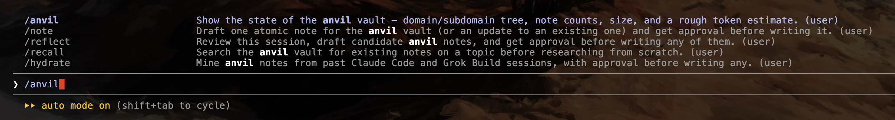

# Anvil


A shared markdown vault. Claude Code and Grok Build write to it and read from it,
as equals. It stops agents from re-solving problems already solved.

## What it is

A folder of small markdown notes, one claim per file, with YAML frontmatter.
Not a database. Not preloaded into any agent's context. Agents search it
on demand with `recall`, and add to it on demand with `note`.

## Prerequisites

**Required:**

- **macOS or Linux.** These scripts avoid bash-4-only syntax (no
  `declare -A`, no `${var^^}`) specifically so they run unmodified on
  macOS's default `/bin/bash` (3.2) — Linux's typically newer default bash
  works fine too, without needing anything installed for that reason.
- **`ripgrep` (`rg`)** — required by `bin/recall`. `install.sh` installs it
  automatically via Homebrew if it's missing; nothing to do ahead of time.
- **Claude Code and/or Grok Build.** Anvil's whole point is an LLM agent
  reading and writing the vault on its own — a plain human typing
  `bin/note`/`bin/recall` by hand works too, but that's not what this tool
  is built for. `install.sh` wires up the `/recall`, `/note`, `/reflect`,
  `/anvil`, `/hydrate`, and `/fill-vault` Skills automatically if Claude
  Code's default location (`~/.claude`) is found; Grok Build support is the
  same `CLAUDE_BLOCK.md`/`AGENTS.md` pointer, wired by hand (see "Wiring a
  project to use anvil" below) since Grok Build has no Skills directory to
  auto-install into.

**Optional:**

- **Homebrew** — strongly recommended, not strictly required. `install.sh`
  uses it to auto-install `ripgrep` and, in multi-machine mode, Syncthing.
  Without it, the installer still runs, but prints a manual-install link
  instead of installing them for you.
- **Syncthing (optional)** — only needed for a multi-machine vault.
  `install.sh` installs it automatically via Homebrew if you choose
  multi-machine mode and it's missing. A single-machine vault needs it not
  at all.
- **Obsidian (optional)** — only for browsing the vault visually (see
  "Viewing the vault in Obsidian" below). Agents never need it, and
  nothing in `bin/recall` or `bin/note` depends on it.
- **`pgrep` (optional)** — used only in the headless-Syncthing
  tunnel-teardown instructions. Ships with macOS by default; nothing to
  install.

## Install

```
./install.sh
```

Or, with no local checkout at all:

```
curl -fsSL https://raw.githubusercontent.com/OnyxDrift/anvil/main/install.sh | bash
```

Must be piped to `bash`, not generic `sh` — this script uses bash-only
array syntax that `dash`/POSIX-mode `sh` (the usual `/bin/sh` on Linux and
macOS) can't run. This form fetches a throwaway copy of the repo into a
temp dir first (`git clone` if `git` is on PATH, otherwise `curl`+`tar`),
runs the installer from there, then deletes it — nothing is left behind
except what gets installed into the vault and, optionally, Claude Code's
skills directory. Pass flags after `--`, e.g.
`curl -fsSL <url>/install.sh | bash -s -- --multi-machine`. Point
`ANVIL_REPO_URL` / `ANVIL_REPO_REF` (env vars) at a fork or different
branch if you don't want `OnyxDrift/anvil`/`main`.

Run with no flags, it asks up to six questions, in order:

1. **Single machine, or shared across more than one?** Single machine installs
   nothing extra. Multi machine installs Syncthing on this machine and prints
   the steps to share the vault folder to your other machines over your LAN.
2. **New vault, or point at one that already exists?** New scaffolds
   `index.md`, `domains.txt`, and `moc/*.md` from scratch. Existing assumes
   the path already has vault content — useful when Syncthing has already
   delivered a copy of the vault to this machine before you run the
   installer here, and you just need `bin/recall`, `bin/note`, and the note
   template laid down.
3. **What path?** Defaults to `$HOME/.anvil`.
4. **Only if `domains.txt` doesn't already exist at that path: what domains
   should this vault start with?** Comma-separated, defaults to `software,
   finance, trading, business, health` — but this is only a suggestion.
   Type your own list instead if you're building a "second brain" around
   different areas entirely (say, `art, woodworking, parenting`); nothing
   about the tool assumes this repo's original taxonomy.
5. **Only if Claude Code's default Skills directory (`~/.claude/skills`)
   doesn't already exist: where is it, so `/recall`, `/note`, `/reflect`,
   `/anvil`, `/hydrate`, and `/fill-vault` can be installed there?** Leave
   blank to skip — nothing else about anvil depends on this. See "Claude
   Code Skills" below for what these actually do.
6. **Add the `anvil` command to your PATH?** Adds one clearly-marked block
   to `~/.bashrc` and/or `~/.zshrc` (whichever exist) so `anvil recall`,
   `anvil note`, `anvil status`, and `anvil init` work from any directory,
   in any new terminal. See "The `anvil` CLI" below.

If your answer to question 2 doesn't match what's actually at the path, the
installer tells you and does the safe thing anyway — it never overwrites
existing notes, `index.md`, `domains.txt`, or `moc/*.md`, whichever answer
you gave.

All six questions can be skipped with flags, for scripted or repeat installs:

```
./install.sh --single-machine --new-vault --path /some/other/dir --domains "art, woodworking, parenting" --skip-claude-skills --skip-add-to-path
./install.sh --multi-machine --existing-vault --path /some/other/dir --claude-skills-dir ~/.claude/skills --add-to-path
```

or by exporting `ANVIL_MODE` (`single`/`multi`), `ANVIL_VAULT_ACTION`
(`new`/`existing`), `ANVIL_HOME`, `ANVIL_DOMAINS`, and
`ANVIL_CLAUDE_SKILLS_DIR` before running. Piped installs (`curl | bash`,
see above) have no terminal to prompt on, so they default to
single-machine, new-vault, the vault's standard path, the suggested domain
list, and installing Skills only if `~/.claude/skills` already exists,
unless those flags or environment variables say otherwise — pass
`--non-interactive` to get that same behavior explicitly in a script.

### Adding a domain later

`domains.txt` is plain user content — `install.sh` creates it once and never
overwrites it, so editing it directly is always safe. To add a domain:

1. Open `domains.txt` and add a line (lowercase, one word or a short phrase,
   no special formatting needed).
2. Re-run `install.sh` (any mode/vault-action flags, it doesn't matter —
   this step only touches `moc/`).
3. It creates the matching `moc/<Domain>.md` for anything new in the file,
   and leaves everything else untouched.

There's no code to edit and no template to update — `moc/` generation reads
`domains.txt` directly every time the installer runs, not a fixed list baked
into the script.

**If a domain gets added through `/note` or `/reflect` instead of by hand,
the Skill creates the matching `moc/<Domain>.md` itself**, in the same step
as adding the line to `domains.txt` — since those Skills don't invoke
`install.sh`'s own generation logic, they'd otherwise leave the domain
with no MOC file, silently (this happened once: `craft` was added to
`domains.txt` with no `moc/Craft.md`, unnoticed until manually checked).
If you ever add a domain by hand outside a Skill and skip re-running
`install.sh` afterward, you'll hit the same gap — running the installer
again is the fix in that case.

Re-running `install.sh` is safe. It upgrades every package-managed file
(`bin/*`, `migrations/*`, `SCHEMA_VERSION`, `TOOLING_VERSION`,
`NOTE_TEMPLATE.md`, `CLAUDE_BLOCK.md`) and all six Claude Code Skills (if
installed) every time. It never touches existing notes, `index.md`,
`domains.txt`, `moc/*.md`, or the vault's own applied-schema marker —
those are your content and vault state, not package files. It also does
not re-ask questions you already answered via a flag or environment
variable. (For refreshing just the tooling on an existing vault without a
full re-run of this script, see `anvil upgrade` instead, under "The
`anvil` CLI" below.)

Syncthing's device pairing needs one click on each machine — that part cannot
be scripted. Choosing multi-machine mode gets you to the pairing screen and
prints the exact steps for both this machine and each client; it does not
click through the pairing for you.

## Usage

Write a note:

```
anvil/bin/note --type procedural --domain software --subdomain bash \
  --project anvil --tags "install-script" \
  --title "How anvil's installer is built and tested"
```

This creates a dated file under the right folder, pre-filled with frontmatter,
and prints the path so you can fill in the body. `--subdomain`, `--project`,
and `--tags` are all optional.

If `--domain` doesn't match anything in `domains.txt`, the command fails and
prints the current list instead of writing anything:

```
$ anvil/bin/note --type semantic --domain widgets --title "..."
invalid --domain: 'widgets' is not in .../anvil/domains.txt
Existing domains:
  - software
  - finance
  - trading
  - business
  - health
...
```

Search canonical notes:

```
anvil/bin/recall "auth"
```

Prints up to 4 matching notes in full. It does not dump the whole vault.
`recall` searches full note content, so a match on a `tags:` or `subdomain:`
value works exactly like a match in the title or body.

## The `anvil` CLI

If you answered yes to question 6 during install (or ran `--add-to-path`),
the vault's `bin/` directory is on your `PATH`, and everything above is
also reachable as short subcommands from any directory, in any project:

```
anvil recall "auth"
anvil note --type semantic --domain software --title "..."
anvil status
anvil usage
anvil audit --field origin
anvil upgrade-vault
anvil upgrade
anvil path
```

`anvil path` prints the vault's root directory — useful in scripts, or
when you've forgotten which path you installed to.

### `anvil usage`

Every `note` and `recall` call — whether run through a Skill or straight
from the CLI — appends one line to a small local log at
`${XDG_STATE_HOME:-$HOME/.local/state}/anvil/usage.tsv`. This log lives
**outside** the vault folder on purpose, so it never syncs via Syncthing —
each machine tracks only its own activity, never mixed with another's.

`anvil usage` summarizes it: total reads/writes on this machine, the
`/recall` hit rate (how often a query actually finds a matching note —
the real signal for whether the vault is worth having), a rough
characters-per-4 token estimate per write and per successful recall, and
a day-by-day activity table for the last two weeks. It's a local trend
line, not a claim about real token savings — comparing a `/recall` hit
against what re-deriving the same answer from scratch would have cost
isn't something this can observe, since only one of those two paths
actually happens in a given turn.

### `anvil init`

Appends this vault's `CLAUDE_BLOCK.md` — the same generated, path-resolved
block described below — to a project's `CLAUDE.md`, without needing to
open and paste it by hand:

```
cd ~/code/some-project
anvil init
```

Creates `CLAUDE.md` if it doesn't exist, or appends to it (with a `---`
separator) if it does. Safe to re-run — the `## Anvil` section is
package-managed content living inside an otherwise user-owned file, same
idea as `bin/*` always refreshing while your notes never do: if the
target already has one, `anvil init` **refreshes it in place** (bounded
to exactly that section — from the `## Anvil` heading to the next `## `
heading or end of file, everything else in the file untouched) if it's
stale, or does nothing and says so if it's already current. It compares
content, not just presence, so an old block left over from before anvil's
own docs changed (e.g. a vault path from before a `--path` move) actually
gets caught and fixed, not silently treated as done.

To target a different directory (e.g. one package in a monorepo, without
`cd`-ing there first):

```
anvil init --path ~/code/some-monorepo/packages/api
```

### Companion tools: `anvil install-additional-packages`, `anvil open-vault`

Both fully optional — nothing else in anvil depends on either.

```
anvil install-additional-packages
anvil open-vault
anvil open-vault ~/some/other/vault
```

`install-additional-packages` installs
[emeraldian](https://github.com/iamrohithrnair/emeraldian), a TUI that
reads an Obsidian-format vault directly — the same plain markdown files
anvil already writes, no conversion or import — and shows notes plus a
force-directed graph, right in the terminal. Installed via Homebrew if
available (matching how `install.sh` already auto-installs `ripgrep`/
Syncthing); without Homebrew, it prints manual `cargo install emeraldian`
or `curl | sh` instructions instead of running them for you.

`open-vault` opens a vault in emeraldian — defaults to this vault's root,
or pass a path to open a different one. Requires emeraldian to already be
installed; it won't install it for you as a side effect.

Two other real, verified candidates were considered and passed over:
`clin-rs` is heavier and more opinionated than a plain viewer needs
(built-in encryption, canvas editing, drawing tools); `obsitui` has too
little community traction (12 stars, no packaged install, manual `npm`
build only) to depend on for something anvil auto-installs.

### Removing it

`anvil` is added via one clearly-marked block in `~/.bashrc` and/or
`~/.zshrc`:
```
# >>> anvil PATH (managed by anvil/install.sh) >>>
export PATH="$HOME/.anvil/bin:$PATH"
# <<< anvil PATH <<<
```
`uninstall.sh` finds and removes exactly this block (nothing else in
those files is touched) as part of its normal cleanup — see "Uninstall"
below.

## Claude Code Skills: /recall, /note, /reflect, /anvil, /hydrate, /fill-vault

Everything above works from a plain terminal. If `install.sh` installed
Skills for you (question 5, or `--claude-skills-dir`), the same behavior is
also available as six real Claude Code Skills — `/recall`, `/note`,
`/reflect`, `/anvil`, `/hydrate`, and `/fill-vault` — usable directly inside a
Claude Code session, in any project, without needing that project's
`CLAUDE.md` wired up first.



These are Skills, not built-in commands: each lives at
`~/.claude/skills/<name>/SKILL.md` (or wherever you pointed `install.sh`),
generated from this repo's `anvil/templates/skills/` with the real vault
path already filled in. You can open and read any of them to see exactly
what they tell Claude to do.

### `/recall <topic>`

Type this yourself, any time you suspect the vault might already have an
answer:

```
/recall syncthing folder sharing
```

**`bin/recall` does literal substring matching (`grep`), not semantic
search.** It looks for your exact text, verbatim, inside note files — it
does not understand synonyms, word order, or intent. Because of this, the
Skill doesn't pass a full question through unchanged: given something like

```
/recall what have we figured out about why syncthing wasn't syncing?
```

Claude is instructed to extract the most distinctive keyword or short
phrase first (here, probably `syncthing`, or `folder sharing`) and search
on that, showing you the raw output either way. A short, specific
`/recall <topic>` is still the more reliable form — the keyword-extraction
step is a fallback for when you ask in full sentences, not a substitute
for being specific.

- **Notes found** — leads with `Anvil: found N relevant note(s)`, then
  reads them and folds them into its answer, instead of re-researching or
  re-explaining something already settled.
- **Nothing found** — leads with `Anvil: no canonical notes match
  "<query>"`, says so plainly, and proceeds with your original question
  as normal. A miss here is informative, not a failure — and it's
  expected the very first time you ask about anything the vault hasn't
  captured yet.

### `/note <what to capture>`

You can dictate the claim directly, or just point at a subject and let
Claude pull the substance from the conversation:

```
/note We decided to store citations as NDJSON instead of SQLite because concurrent agent writers were locking the SQLite file.
```

```
/note today's fix to how the recall skill handles full-sentence questions
```

Both are valid — the second isn't required to be a complete claim, since
Claude is instructed to draft the real content itself when given just a
topic, the same way `/reflect` does.

**A claim about anvil itself uses `--project anvil`**, not the name of
whatever repo anvil happens to be living in — this is worth stating
explicitly because it's easy for a draft to default to the current repo's
name instead.

**Nothing gets written immediately.** Claude first checks `recall` for a
near-duplicate, then drafts and shows you the proposed `--type`,
`--domain`, `--subdomain`, `--project`, `--tags`, and full body text —
without running `bin/note` yet. It then asks you to decide using Claude
Code's interactive question tool — an actual selectable menu (arrow keys,
not free-typed prose), labeled `Anvil Note` (whether it's a new note or
an amendment — that distinction is in the question text, not the label)
so it's identifiable as anvil at a glance — with two options:
**Approve** (writes exactly what was shown) and **Reject** (nothing gets
written). There's no separate "request changes" option — the menu always
includes a free-text choice on its own (labeled something like "Type
something"); use that to describe what to fix, and it redrafts and asks
again the same way, still without writing.

Only after you pick Approve does it run `anvil/bin/note` and report the
result as one line starting with `Anvil:` — e.g. `Anvil: wrote new note
at anvil/semantic/2026-...-title.md` — using a path relative to the
vault, not the full absolute path. If what you described is really two
or more distinct claims, expect (and it's correct behavior for) Claude to
draft — and, once approved, write — separate notes instead of merging
them into one.

### `/reflect [optional focus]`

Type this at the end of a work session, instead of trying to remember
everything worth keeping yourself:

```
/reflect
```

or, to narrow scope:

```
/reflect focus only on what we learned about the Syncthing setup, skip the rest
```

Claude reviews the conversation, checks `recall` for each candidate to
avoid duplicating an existing canonical note, and drops anything that's
just a recap of what was done rather than a lesson or decision. If
nothing survives that filter, the correct behavior is saying so and
drafting nothing — a `/reflect` that always produces notes regardless of
content isn't working correctly.

**Otherwise, it presents every surviving candidate** — same preview shape
as `/note`, one entry per distinct claim — as a multi-select interactive
menu labeled `Anvil Review`, not a numbered list you reply to in prose:
select as many as you want to approve, leave the rest unselected to skip
them, or use the menu's free-text option on an individual candidate to
request changes to it before deciding. **If exactly one candidate
survives, it falls back to a plain Approve/Reject question** (like
`/note`'s) instead of a multi-select — `AskUserQuestion` requires at
least two options, so a one-item multi-select isn't valid; the header
still reads `Anvil Review` either way, not `Anvil Note`. Only the notes
you actually selected get written, with any requested changes applied.
Every new note is linked into its domain's `moc/*.md` file automatically
— no separate question, same as `/note`. Afterward it lists what was
actually written, each line starting with `Anvil:` and using a
vault-relative path (`Anvil: wrote new note at
anvil/procedural/2026-...-title.md (linked from moc/Software.md)`).

**Both `/note` and `/reflect` can propose amending an existing note
instead of writing a new one** — if `recall` turns up a note that's
already about the same claim, and what you're adding is a small
correction or clarification rather than a genuinely distinct fact, the
draft will say so and show only what's actually changing in that file.
This never touches `type`/`domain`/`project`/`source` — only the body and
`updated:` date. It's still gated by the same approval step as everything
else here.

### `/anvil` — vault status and metrics

Read-only, no approval step needed since it never writes anything:

```
/anvil
```

Runs `anvil/bin/status` and shows the raw output: note counts by type and
by status, a domain → subdomain tree (rooted at whatever's in
`domains.txt`, so a domain with zero notes still shows up), a warning if
any note uses a domain that isn't in `domains.txt` (drift — a sign
something was written outside the normal `/note`/`bin/note` path, since
that path enforces the check), a warning listing any canonical note not
linked from any `moc/*.md` file (orphans — notes `recall` can still find,
but that don't show up if you're browsing the vault visually in
Obsidian), vault size on disk, and a rough word/token estimate for the
canonical content.

That token estimate is a size measurement, not a savings claim — it's
`~4 characters per token`, no real tokenizer involved, and it describes
the *whole* canonical vault, not what a single `/recall` call actually
costs (which returns at most 4 matching notes, not everything). Use it to
judge relative vault growth over time, or to compare a `/recall` call's
real cost against re-deriving the same answer from scratch — not as a
precise accounting figure.

### `/hydrate` — mine past sessions into notes

Anvil only captures knowledge from the live session it's invoked in. Real
work often happened before anvil existed, or in sessions that never ran
`/note`. `/hydrate` mines that history:

```
/hydrate
```

It scans this project's past sessions on **both** Claude Code
(`~/.claude/projects/<encoded-dir>/*.jsonl`) and Grok Build
(`~/.grok/sessions/<encoded-dir>/*/`), shows the full list up front —
each with a cheap one-line gist of what that session opened and closed
with — then asks (via `AskUserQuestion`, not silently) whether to process
the newest not-yet-hydrated one or a different one you pick from the
list. Candidates go through the same recall-check, draft, and
`AskUserQuestion` approval flow as `/reflect` — nothing gets written
without approval.

**It's not limited to the exact directory you're standing in.** Claude
Code (and Grok Build) key session storage by the *exact literal directory*
a session was launched from — a session started at a monorepo's root and
one started from a package inside it land in two completely separate,
unrelated folders, with nothing linking them. `bin/sessions` scans the
current directory **and every subdirectory beneath it** (not upward — run
it from whichever root you want to sweep) to merge sessions from every
package in one pass. The listing groups sessions under a heading per
source directory, current directory first, so it's always clear which
literal directory each session actually came from.

Matching a candidate session's directory has to be more careful than a
plain string-prefix check: Claude Code's own encoding turns both `/` and
a literal `-` in a directory name into `-`, so a folder literally named
`repo-old` is indistinguishable, by name alone, from a subdirectory `old`
under `repo`. `bin/sessions` uses the encoded name only as a cheap
first-pass filter, then confirms each Claude Code session against its own
recorded `"cwd"` field (present in every session file) — exact, no
guessing. Grok Build sessions don't have a confirmed field to do the same
check against yet, so they still rely on name matching alone until that's
verified against real data.

Each session carries one of four statuses, shown as a color-coded emoji in
the Skill's listing (🟡🟢🟣🔴 — chat transcripts render markdown, not raw
terminal color) or as real ANSI color if you run `anvil/bin/sessions
--pretty` yourself in a terminal:
- 🟡 **new** — not yet hydrated
- 🟢 **hydrated** — fully processed, every candidate got a decision
- 🟣 **partial** — processed, but stopped before every candidate was decided
- 🔴 **failed** — couldn't be read or parsed at all (e.g. a Grok schema
  mismatch)

**The one thing this does that `/reflect` doesn't need to:** since older
sessions can reflect an earlier, later-corrected understanding, `/hydrate`
walks sessions newest-first and checks every candidate from an older
session against what's already canonical (and against anything already
approved earlier in the same hydrate run). If an old session's claim
actively disagrees with the newer material, it's surfaced as a flagged
conflict, not silently written or silently dropped — you decide which one
was actually right.

Notes written this way get an automatic `hydrated` tag, so their
provenance (recovered from old session history, vs. written live) stays
visible later. After each session, it asks whether to continue to the next
one, jump to a different one from the list, or stop — a small state file
(`~/.local/state/anvil/hydrated.tsv`, machine-local like `usage.tsv`,
never synced) tracks what's already been processed so re-running
`/hydrate` later doesn't lose track or duplicate work.

Grok Build support is based on its documented on-disk format, not yet
tested against a real `~/.grok/sessions` tree — if a Grok session doesn't
parse cleanly, `/hydrate` says so and skips it rather than guessing.

### `/fill-vault` — propose real values for empty metadata fields

```
/fill-vault
```

`bin/upgrade-vault` migrations only ever add a missing field *empty* —
never a guessed value, since a plain script can't judge whether a guess
is true.
`/fill-vault` is the deliberate other half: it has real context to propose
values from (this conversation, past sessions, a note's own content), but
every proposal still goes through the exact same approval gate as
`/note`/`/reflect`/`/hydrate`. Nothing is written without approval.

It runs `anvil/bin/audit --field origin` (today's one real case), and for
each flagged note looks for a genuinely defensible signal — written in
this session, tied unambiguously to a known repo via its `project`, or
traceable through `bin/recall`/`bin/sessions`. If a real signal exists, it
proposes a value with its reasoning shown in one sentence. **If none
exists, it says so and proposes nothing for that note** — a note left
empty is honest; a plausible-sounding guess is exactly what this exists to
prevent. Survivors go through the same `Draft`/`AskUserQuestion` approval
flow as everything else, and only approved values get written.

### A note on how these get invoked

`/recall`, `/note`, and `/reflect` are meant to be typed by you, directly —
that's the gap this closes versus relying purely on the natural-language
instruction in `CLAUDE.md` (which only works if the agent happens to
notice it applies). Nothing here disables the older behavior — an agent
that reads the Anvil block in `CLAUDE.md` may still reach for
`anvil/bin/recall`/`anvil/bin/note` directly on its own judgment, same as
before. The Skills are the reliable, explicit way to trigger the same
thing yourself, not a replacement for that judgment.

**Every message any of these Skills sends starts with `Anvil:`** —
not just the first line or the final result, every step in between too
("Anvil: searching...", "Anvil: drafting...", "Anvil: writing it now...").
The intent is that any anvil action is identifiable at a glance,
throughout the whole interaction, not just bookended at the start and end.

## Uninstall

```
./uninstall.sh
```

Removes only the package-managed files (`bin/recall`, `bin/note`,
`bin/status`, `bin/anvil`, `bin/NOTE_TEMPLATE.md`, `CLAUDE_BLOCK.md`), the
`/recall`, `/note`, `/reflect`, and `/anvil` Skills (from
`~/.claude/skills` by default — override with `--claude-skills-dir`, same
as `install.sh`; only those four subdirectories are touched, nothing else
there), and the anvil `PATH` block from `~/.bashrc`/`~/.zshrc` if
`install.sh` added one (only that clearly-marked block, nothing else in
those files). Your notes, `index.md`, `domains.txt`, and `moc/*.md` stay
on disk.

To delete all vault content — notes, `index.md`, `domains.txt`, `moc/`,
everything:

```
./uninstall.sh --purge
```

This asks for confirmation (type the vault path back), then — if you didn't
already say via a flag — asks whether to also delete the `anvil/` folder
itself, or just empty it and leave the folder in place. Keeping the folder
(along with its `.stfolder` marker, if Syncthing created one) means an open
Obsidian window or a Syncthing folder pointed at that path doesn't lose the
directory out from under it; that's why it's the safer of the two, and the
default in a non-interactive run. This is all irreversible either way.

Skip that question with an explicit flag, for scripted runs:

```
./uninstall.sh --purge --keep-folder     # empty contents, keep the folder
./uninstall.sh --purge --delete-folder   # remove the folder entirely too
```

Only use `--delete-folder` if nothing else (Obsidian, Syncthing) still
references that exact path.

## Vault structure

```
anvil/
  index.md         # one line per note, the map of the vault
  domains.txt      # the allowed domain list — edit this file to add one
  CLAUDE_BLOCK.md   # generated pointer block, path pre-filled — paste into a project's CLAUDE.md
  moc/              # maps of content — one generated file per domain
    Software.md      # (this set matches whatever's in domains.txt —
    Finance.md        #  the suggested default, shown here as an example,
    Trading.md         #  not a fixed list)
    Business.md
    Health.md
  semantic/         # facts that stay true (e.g. "auth is Clerk, not NextAuth")
  procedural/       # how we build, test, deploy
  strategic/        # decisions, and why — do not reopen without reading first
  episodic/         # dated notes: what was tried, what happened
  raw/              # unprocessed dumps — recall ignores this
  _inbox/           # draft notes awaiting review — recall ignores this
  _review/          # notes flagged for the weekly janitor pass
  _archive/         # retired notes — recall ignores this
  bin/
    recall          # search canonical notes
    note            # write a new note
    status          # domain/subdomain tree, note counts, size, token estimate
    NOTE_TEMPLATE.md
```

## Rules

- One vault. Do not also use Claude's or Grok's built-in memory features as a
  second knowledge store.
- Never preload the vault into `CLAUDE.md`. Point at it; do not paste it.
- One claim per note. Frontmatter is required on every note.
- `recall` reads only `status: canonical` notes, and only from `semantic/`,
  `procedural/`, and `strategic/`.
- If you sync this vault across machines (Syncthing) and get a conflict on
  those three folders, the copy on your primary coder-agent machine wins.

## Categorizing notes: domain, subdomain, project, tags, origin

Four fields, each doing a different job — the two most often confused for
each other are `subdomain` and `project`, so read those two together:

- **`domain`** — broad, few, stable. Must match a line in `domains.txt`.
  `bin/note` enforces this: an unrecognized domain is a hard error, printing
  the current list. You choose the starting list at install time (defaults
  to `software`, `finance`, `trading`, `business`, `health`, but that's only
  a suggestion). This list is meant to stay short — if a note genuinely
  doesn't fit any of these, that's a decision for a human to make
  deliberately (add a line to `domains.txt`), not something an agent should
  invent on its own.
- **`subdomain`** — free text, no enforcement. **Normally a tool,
  technology, or language** — `syncthing`, `python`, `ssh`, `ripgrep`. Not
  one of your own projects; that's what `project` is for. **For a domain
  where notes usually aren't about software tooling at all** (e.g.
  `trading`, `finance`), `subdomain` may instead be a topical sub-category
  of that domain — `backtesting`, `portfolio-theory`,
  `performance-metrics` — still never a project, and still worth checking
  `bin/status`'s existing tree first to reuse a category instead of
  inventing a near-synonym. This pattern was validated in real use: a
  `/hydrate`-adjacent session mining general trading/quant mechanics out
  of a codebase used exactly this shape across ten notes with no
  `project` conflict and no invented near-duplicates.
- **`project`** — free text, no enforcement. **One of your own named
  projects** — `anvil`, `citeforge`, `swing-stack`. Not a tool or
  technology; that's what `subdomain` is for. Putting the same value in
  both fields (e.g. `subdomain: anvil` and `project: anvil` on the same
  note) is a sign the note is miscategorized, not that it's extra-tagged.
- **`tags`** — free-form keywords, a YAML list (`[python, cli, docker]`).
  Not enforced, and can overlap with `subdomain` or `project` — use tags
  for anything that would help a future search find the note, even if it's
  not the note's main subject. Obsidian reads this field natively and
  builds a clickable Tags pane from it across the whole vault, on top of
  the MOC/graph structure described below.
- **`origin`** — free text, no enforcement. **What backs the claim** — not
  who wrote the note (that's `source`). For code, a git remote URL if one
  exists, else the repo's local root path, else the plain working
  directory if it isn't a git repo at all. For anything else, a book
  title, a webpage URL, a PDF filename — whatever the claim is actually
  citing. `bin/note` auto-detects the code case from the caller's current
  directory; pass `--origin` explicitly to override it, or for a non-code
  domain where nothing can be auto-detected.

## Versioning and upgrades

Anvil tracks **two independent version axes** — conflating them was a
real early mistake this README used to reflect, so they're deliberately
kept apart everywhere now:

- **Schema** — the shape of a note's frontmatter (the `origin` field was
  the first real example of this changing). Tracked by `SCHEMA_VERSION`
  (what's installed; package-managed, `install.sh` overwrites it every
  run) and `.anvil-applied-version` (what this vault's actual note *data*
  has been migrated to — vault state, only `bin/upgrade-vault` writes it).
  Fixed by **`anvil upgrade-vault`** (or `--dry-run` to preview first),
  which runs whatever migrations (`migrations/*.sh`) are outstanding, in
  order, updating `.anvil-applied-version` after each one succeeds — not
  batched at the end, so a failure partway leaves accurate state instead
  of corrupting it or silently skipping ahead.
- **Tooling** — the anvil scripts and Skills themselves. Tracked by
  `TOOLING_VERSION` (also package-managed). Deployment here is always a
  full atomic overwrite, so unlike schema there's no separate "applied"
  marker to track. Fixed by **`anvil upgrade`**, which pulls fresh
  `bin/*`/Skills/`NOTE_TEMPLATE.md` from wherever `install.sh` recorded as
  this vault's tooling source, in
  `${XDG_STATE_HOME:-$HOME/.local/state}/anvil/tooling-source`,
  **deliberately outside the vault folder** so it never syncs via
  Syncthing (each machine's own source is specific to that machine) —
  without needing to re-run the full interactive installer. Conservative
  by default: it only refreshes Claude Code Skills if they were already
  installed for this exact vault, and never touches shell rc files unless
  `--add-to-path` is passed.

  That recorded source is one of two things: a local clone path (the
  default for a normal `./install.sh` run out of a cloned repo), or a
  `git:<url>#<ref>` pointer — recorded automatically for a
  `curl | bash` install (there's no durable clone to point at), or for any
  install run with `--remote-upgrades`. With the `git:` form, `anvil
  upgrade` fetches a fresh throwaway copy straight from GitHub every time
  instead of expecting a local clone to still exist — so the clone used
  for the initial install (if there was one) can be deleted right after.

`bin/status` shows both versions, each with its own mismatch warning — a
vault can be behind on schema, tooling, both, or neither, and it says
which.

**The one rule that matters most, and the reason these two commands stay
separate:** migrations (`migrations/*.sh`, run by `upgrade-vault`) are
pure, deterministic, idempotent scripts — never an LLM call, never a
guess. They may only add structure (an empty field, a rename) to existing
notes, never fabricate real values for old data — there's no safe way to
reconstruct, for instance, what a pre-existing note's real `origin`
should have been. `bin/upgrade-vault` adds the field empty; `bin/status`
then flags which notes still need a real value (via `bin/audit`), and
filling those in is a deliberate, separate, human-in-the-loop activity —
the `/fill-vault` Skill proposes values with its reasoning shown, but writes
only what's explicitly approved, same gate as every other anvil write.

### The full upgrade chain — three separate steps, each one optional

These aren't merged into one command on purpose — you can take tooling
updates without being forced into a schema migration, or run a schema
migration without immediately backfilling values. Each step tells you
whether the next one is worth running; none of them run automatically:

1. **`anvil upgrade`** refreshes the scripts/Skills from your source
   repo. If that pulls in a newer `SCHEMA_VERSION` than this vault's data
   is actually migrated to, it says so at the end — e.g. *"installed
   schema is now 0.0.0_2; this vault's data is still at 0.0.0_1. Run
   `bin/upgrade-vault` when ready."* You can stop here and keep using the
   vault on its current (older) note shape indefinitely; nothing forces
   the next step.
2. **`anvil upgrade-vault`** runs the outstanding migrations. If any of
   them leave real gaps (an empty `origin:`, say), it says so at the end
   — e.g. *"1 canonical note(s) still have an empty origin... run the
   `/fill-vault` Skill."* You can stop here too — an empty field is
   honest, not broken.
3. **`/fill-vault`** (a Skill, not a CLI command — it needs an LLM to
   judge whether a proposed value is actually defensible) proposes real
   values for whatever's still empty, with its reasoning shown, and
   writes only what you approve.

`bin/status` surfaces the same two "you're behind" warnings independently
at any time, so you don't have to run a command just to find out whether
one is needed.

`CHANGELOG.md` is the human-readable "why" layer — one entry per version
bump (either axis), explaining what changed and why. It's never parsed by
either upgrade command; the migration scripts and `install.sh` are the
actual mechanism, this file is just for people (and future sessions) to
understand the history.

## Viewing the vault in Obsidian

Obsidian is a viewer, not a requirement. Agents never need it. Use it to
browse the vault yourself.

### Opening it

1. Install Obsidian (https://obsidian.md), if not already installed.
2. On first launch, choose **Open folder as vault**.
3. Select the anvil folder (`$HOME/.anvil` by default).
4. Obsidian may ask about community plugins or trusting the vault — decline
   both. Nothing here needs a plugin.

You will see the folder structure in the left sidebar: `index.md`, `moc/`,
and the `semantic/`, `procedural/`, `strategic/`, `episodic/` folders, plus
whichever notes exist so far.

### The graph view

Click the graph icon in the left ribbon (or press `Cmd+G` / `Ctrl+G`) to open
**Graph view**. This is the "map" — one dot per note, with lines between notes
that link to each other.

**Expect it to look nearly empty at first.** `note` does not add links
between files automatically — it only fills in frontmatter and a title. A
graph with 30 notes and no lines between them is not broken; it means no
note references another one yet.

Two ways to make the graph show real structure:

- **Add links during the janitor pass.** When `moc/Software.md` (or
  whichever domain fits) or `index.md` gets updated to list a note, write
  it as a link: `- [[2026-09-09-anvil-installed-on-foundrybox]]`. Once a
  MOC file links out to notes, the graph shows that MOC as a hub with lines
  to every note it references — this is the actual spiderweb structure,
  built up over time as the janitor pass runs.
- **Color by folder, without needing links yet.** In Graph view, open its
  settings (gear icon) and add a **Group**: a query like `path:semantic`
  colored one way, `path:strategic` another, and so on for each type. This
  colors every note by category immediately, even with zero links, so you
  can see how much you have in each bucket before any linking exists.

### Confirming it is working

Check for these, in order:

1. **A new note appears in the file explorer**, inside the folder matching
   its `type` (a `procedural` note lands in `procedural/`, not `semantic/`).
2. **Frontmatter shows in the Properties panel** at the top of the note —
   `type`, `domain`, `subdomain`, `project`, `source`, `status`, `updated`,
   and `tags` all present. A note missing a field failed to follow the
   template; check what wrote it.
3. **Search finds it by property.** Open Obsidian's search (`Cmd+Shift+F` /
   `Ctrl+Shift+F`) and search `status:canonical` — every canonical note
   should be listed. This is the same filter `anvil/bin/recall` uses from
   the command line, so the two should agree.
4. **On a multi-machine setup, the note appears on the other machine.**
   Write a note on one machine, wait a few seconds, then check the vault on
   the other. Syncthing's own tray icon or web UI (`http://localhost:8384`)
   shows a sync-in-progress indicator while it catches up, and settles to
   "Up to Date" once done.

If a note is missing after a few minutes on a paired machine, check
Syncthing's web UI on both ends for the `anvil` folder's status — "Out of
Sync" or an error there is the first thing to look at, not the vault files
themselves.

## Wiring a project to use anvil

**If the `anvil` CLI is on your PATH** (see above), this is one command:
```
cd /path/to/the/project
anvil init
```

**Otherwise, do it by hand** with **`$ANVIL_HOME/CLAUDE_BLOCK.md`** — the
copy generated *inside the vault* by `install.sh`, not the master template
at `anvil/CLAUDE_BLOCK.md` in this repo. The generated copy has the real,
actual vault path already filled in; the repo's master copy holds a
`__ANVIL_HOME__` placeholder, since it's written once and reused across
every machine that runs the installer, regardless of what path each one
chooses.

Paste the generated block into the target project's `CLAUDE.md` (or
`AGENTS.md` for Grok Build). Do not paste vault content — only the pointer
block. `install.sh` also prints this block directly to the terminal at the
end of every run, ready to copy without opening any file.

`CLAUDE_BLOCK.md` is regenerated every time `install.sh` runs — it's a
package-managed file, not user content, so any wording improvements made to
the repo's master template reach every vault the next time its installer
runs there.

## Syncing across machines

Anvil itself has no sync logic — it is plain files, on purpose. Use an
existing, well-maintained sync tool instead of writing one:

- **Syncthing** (recommended): share only the `anvil` folder as its own
  Syncthing folder, not the whole `$HOME` directory. Pair each machine's
  device ID once, in each machine's Syncthing web UI
  (`http://localhost:8384`).
- Add each new machine (laptop, Mac Mini, etc.) as a Syncthing device, and
  accept the `anvil` folder share on that machine, pointing at
  `$HOME/.anvil`.

### Headless machines (no display — Mac Minis run over SSH)

Syncthing's web GUI binds to `127.0.0.1` by default — it only answers a
browser running on the same machine. A plain `ssh` session gets you a shell,
not that. Use an SSH local port forward instead, run from the *other* machine
(the one with a browser, e.g. your laptop):

```
ssh -L 8384:localhost:8384 <user>@<headless-host>
```

Leave that connection open, then open `http://localhost:8384` in a browser
on the machine you ran it from — that's the headless machine's Syncthing GUI,
tunneled over SSH. Use it for every GUI step (Add Folder, Show ID, accepting
a folder share).

**Everything typed after that `ssh` command runs on the headless machine, not
the one you typed it from.** Check the shell prompt changed before running
anything else — `brew install` typed here installs on the remote end, not
locally, even though the terminal window is sitting on your own screen.

**If the machine you're tunneling *from* already runs its own Syncthing**
(true for most machines once a multi-machine setup is actually running),
port 8384 there is already taken, and the command above will fail to bind.
Forward to a different local port instead, and browse that port number:

```
ssh -L 8385:localhost:8384 <user>@<headless-host>
# then open http://localhost:8385
```

`8384` on that machine keeps showing its own local Syncthing; `8385` reaches
the remote one, tunneled. Both are usable at the same time.

**Tear it down when done:** close that terminal, or press `Ctrl+C` in it —
the tunnel ends immediately, and nothing was installed or left running by it.
If you started it backgrounded with `-f`, instead:

```
pgrep -f '8384:localhost:8384'   # or whichever port you used
kill <pid printed above>
```

`anvil/install.sh` prints this same notice automatically when you choose
multi-machine mode.

## Troubleshooting Syncthing pairing

Two things that look like a broken sync, but aren't:

**Devices show "Connected," but the folder still doesn't show up on the
other machine.** Adding a remote device and sharing a folder with it are two
separate steps in Syncthing. Trusting a device (pasting its ID, seeing
"Connected") does not share anything by itself. On the machine that already
has the vault, edit the `anvil` folder, open its **Sharing** tab, and check
the box for the new device — only then does the other machine get an
incoming folder offer to accept. Until that checkbox is ticked, the folder
will sit at "unshared" on the sending side and never appear on the
receiving side, with no error raised on either end.

**Syncthing prompts to set a GUI username and password — this is unrelated
to device sync.** That prompt is about whether other local users on the
same machine can open the Syncthing web UI without logging in. It has
nothing to do with how two Syncthing instances trust each other (that's
handled entirely by device ID certificates, exchanged when you add each
other's device ID). Setting or skipping it does not affect whether folders
sync — don't chase it if sync looks stuck for another reason.

## Reinstalling on a new machine

1. Clone or copy this repo.
2. Run `./anvil/install.sh`.
3. Pair the new machine into your existing Syncthing share for `anvil`.
4. Paste the `CLAUDE_BLOCK.md` snippet into any project on that machine that
   should use the vault.

No other setup is required — `recall` and `note` are self-contained scripts
with no dependency beyond `ripgrep` — `install.sh` installs it via Homebrew
automatically if it's missing, on every machine you run it on.

**Order matters if you pair Syncthing first.** If Syncthing has already
delivered a full copy of the vault to the new machine before you run
`install.sh` there, answer **existing vault** at question 2 (or pass
`--existing-vault`). This only lays down `bin/recall`, `bin/note`, and the
note template — it will not touch the notes that arrived via sync. Answering
**new vault** in that situation is also safe (nothing gets overwritten
either way), but existing is the accurate answer and skips the "found
content but you said new" notice.
